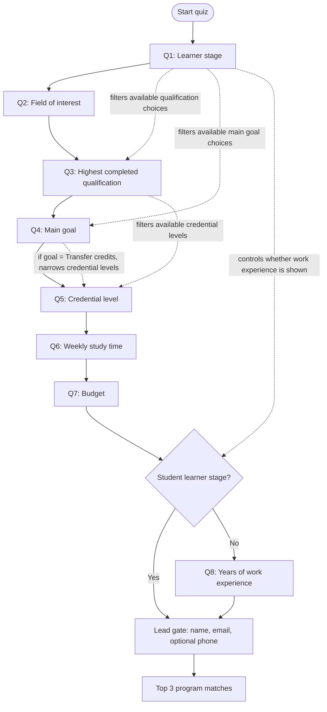
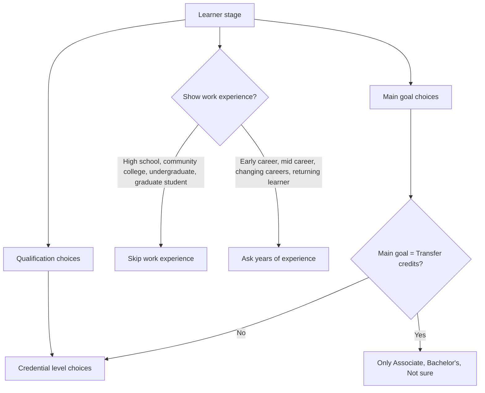

# Degree Match Quiz Flowchart

## Manager Review Version

## How To Read It

Solid arrows show the screen order users move through.

Dotted arrows show where an earlier answer changes later options.

The quiz is mostly linear. The main branching behavior is filtering, not sending users into separate paths.

## Branch Detail

## Manager Review Questions

1. Should graduate students skip the work-experience question?
2. Should Transfer credits limit users to Associate, Bachelor's, and Not sure only?
3. Are Returning learners allowed to choose Start college?
4. Do we want a fallback message if a selected category has fewer than three close online matches?

All offered programs are treated as online, so the quiz no longer asks separate delivery or regional preference questions.

## Code Pointers

- Questions and option lists: `degree-match/index.html`, around `const QUESTIONS`
- Branch/filter rules: `degree-match/index.html`, around `const OPTION_FILTERS`
- Visible-question logic: `getVisibleQuestions()`
- Filtered-option logic: `getFilteredOptions()`
- Downstream answer reset: `clearDownstreamAnswers()`
- Final scoring: `scoreProgram()`
